# CS 340 – Operating Systems

## HOP04 - Input, Output and Throughput

```text
7/13/2019 Developed by Kevin Wang
06/17/2020 Reviewed by Kim Nguyen
03/29/2021 Updated by Matt Raio
02/14/2022 Reviewed by Ken Ling
```


## School of Technology & Computing (STC) @ City University of Seattle (CityU)

Before You Start

- This exercise assumes that the user is working with a Linux virtual machine in virtualbox.
- All commands and code discussed in this exercise will run in the Ubuntu console.
- The directory path shown in screenshots may be different from yours.
- Some steps are not explained in the tutorial. If you are not sure what to do:
  1. Consult the resources listed below and experiment in the Ubuntu console and try to solve the problem yourself.
  2. If you cannot solve the problem after a few tries, ask a TA for help.

### Resources

- Linux command line: bash + utilities
<https://ss64.com/bash/>
- Nano/Basics Guide
<https://wiki.gentoo.org/wiki/Nano/Basics_Guide>

### Preparation

   > Connect to your Ubuntu instance
   > Using parameters and variables

1. Type the following command to reuse HelloWorld.sh file:

   ```sh
   nano HelloWorld.sh
   ```

2. Update the file content as below:
   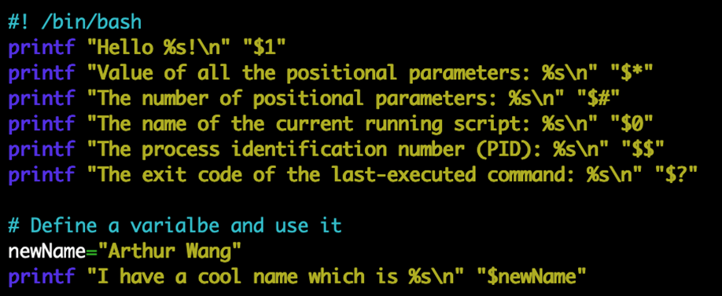
   - Note: A positional parameter is an argument specified on the command line. Positional parameter values are stored in a special set of variables that can be accessed via positional parameters. For example, the first, second, and third positional parameter values can be retrieved via the positional parameter `$1, $2, and $3`, respectively. Parameters greater than 9 can be accessed by using curly braces around the number; for instance, `${10}` would be the `tenth parameter`.
    Besides positional parameters, there are other special parameters to retrieve other information, such as PID and exit code of the last executed command, as shown in the first part of the script.

3. Click the `control + x` key to quit
   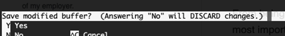

4. Type the `y` key and then hit the `enter` key to save the file
   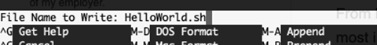

5. Type the following command to see the result (please change the name to your name)
   Note: the command below has 3 parts: `interpreter` (i.e. bash shell); `command name` (`i.e. HelloWorld.sh`); and `arguments` (`i.e. Kevin Wang`).
        `bash HelloWorld.sh YourName`
   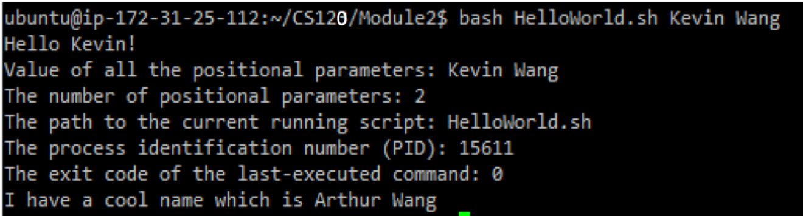

## Format and print data with printf command

   > The basic syntax for printf command is: `printf format arg1 arg2 …`
   > You can find all escape codes and format specifiers here:
   <https://wiki-dev.bash-hackers.org/commands/builtin/printf>

1. Create a `TestPrintf.sh` by typing the following command in the console command line:

   ```bash
   nano TestPrintf.sh
   ```

1. Type scripts in the file as below:

   ```bash
   # ! /bin/bash
   printf "Two tabs after me\t\tA new line after me\nThe hexadecimal digits X42 represents \x42\n"

   printf "%s\n" Print in separated lines "Print in one line"
   printf "%b\n" "%b tells printf to escape sequences. Two tabs after me\t\t ."
   printf "%s%d\n%s%f\n%s%e\n" "%d prints integer such as: " 25 "%f prints float numbers such as: " 25.5 \ "%e prints with the exponential notation such as: " 25. 5
   printf "%s#%02x%02x%02x\n" "%x prints in hexadecimal. Here is an example to convert a RGB color 82 185 225 to a hex notation: " \ 82 185 255

   # Use width specification
   header="\n %-10s %-18s %8s\n"
   format=" %-10d %-18s %8.2f\n"
   printf "$header" Id Name "Order price"
   printf "================================\n"
   printf "$format" 1 "Kevin Wang" 234.30 2 "Arthur B" 332.23 3 "Evan A" 525.32
   ```

   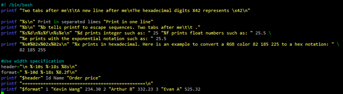

1. Hit the `control + x` key to quit and save the file

1. Execute the file to see the result by typing following command:

   ```sh
   bash TestPrintf.sh
   ```

### Input and Output

1. Create a file by using the standard output operation `>`
   > Type the following command in the console command line:

   ```sh
   printf “%s\n” “My text in the file” > test
   ```

2. Check the file content by typing the following command:

   ```sh
   cat test
   ```

   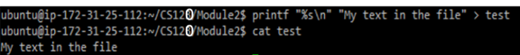

3. Read data from a file to a variable by using the standard input operation <

   ```sh
   read content < test
   ```

4. Check the variable value by typing the following command:

   ```sh
   echo $content
   ```

   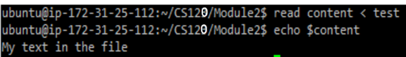

### Using pipelines and command substitution

   > A pipeline can help users to take one command’s output as another command’s input

1. Save top command result to a file by typing the following command in the console command line:

   ```sh
   top -n 1 | tee result
   # You will see the result from top command
   ```

2. Clear the screen by typing the following command:

   ```sh
   clear
   ```

3. Check the result file:

   ```sh
   cat result
   ```

   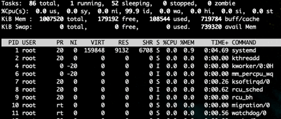

4. We also can use the command substitution to store the command output to a variable:

   ```sh
   lsResult=$(ls)
   # We are saving the ls command’s output to the lsResult variable
   ```

5. Check the variable value by typing the bash command:

   ```sh
   echo $lsResult
   ```

Take a screenshot of your `printf` commands as well as your pipelines and substitutions.

What commands did you have to substitute? Were there any challenges you faced with the instructions vs. what your OS had in its environment?

> I didn't have any issues besides my shared folder not sharing with my instance otherwise it was fine.

Submit your Work to Brightspace

Please upload all your files for this hands-on practice to the HOP assignment on Brightspace.

### Shell Scripts


### Screenshots

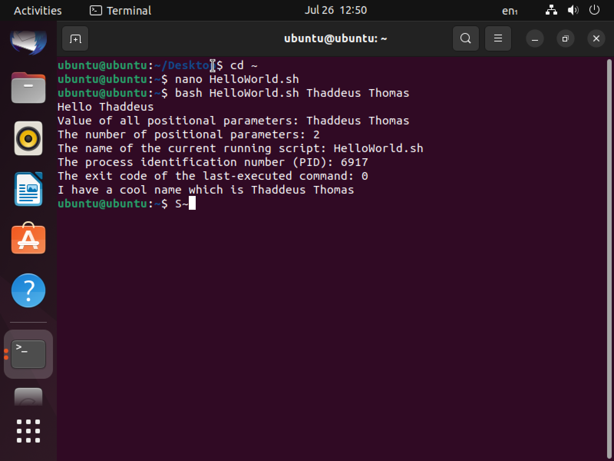

---


---

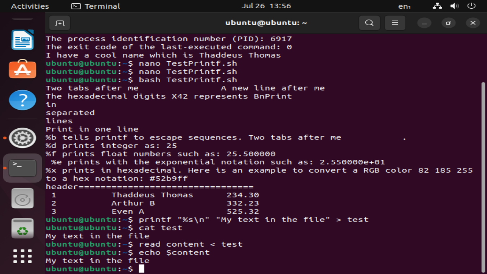

---

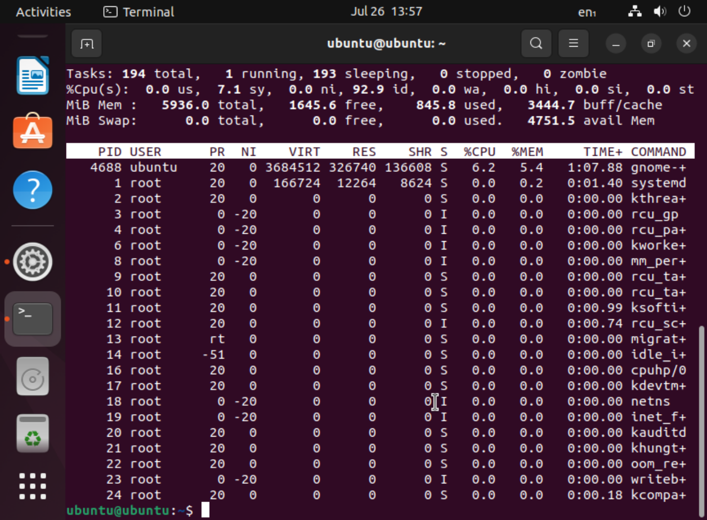

---

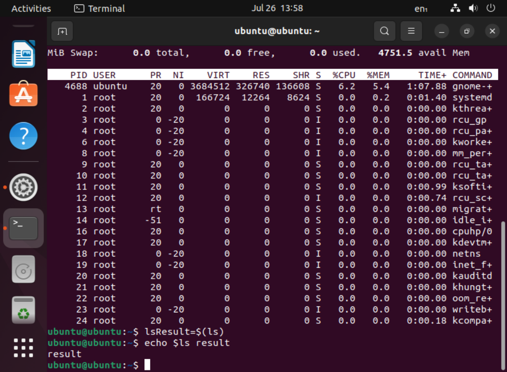
